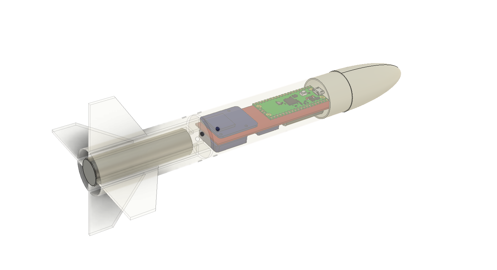
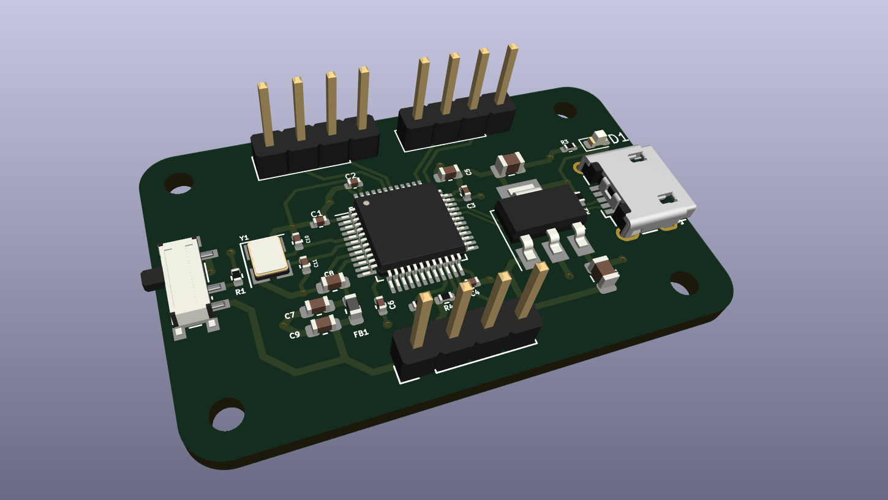

  
 So, I haven't been keeping up this blog very well, but don't worry, I'm back with a new project. I'm calling it "Sparrow"—it's a reintroduction to both embedded development and rocketry.

My goals for this project are to:

1. Design my own custom board from scratch
2. Create a framework for rocket flight code
3. Learn FreeCAD
4. Re-familiarize myself with OpenRocket and making rockets
5. …and maybe make my own rocket fuel, we'll see  
 My ultimate goal for Sparrow is to create a "fully" mechanical hobby rocket, with thrust vectoring, telemetry, mechanical recovery mechanisms, custom electronics, the whole works. I haven't used the skills I learned in college much since I graduated, and I don't want them to go to waste. I know that this is a huge undertaking, but I think that I will be able to reuse what I learn and make in this project elsewhere.

## Electronics

For my first iteration, I'm being lazy and using a development board with broken out sensors from Adafruit. I've decided to use a BMP280 for altitude measurements and an MPU-6050 for IMU measurements. I figure these will be easy to get a hold of both the physical sensors and reference schematics when I finally start designing the board.  

 For the microcontroller I'm using an STM32F103C8T6, for the same reasons as the sensors. Funnily enough this is my first time really using the Blue Pill, I've used Feathers, Nucleos and normal Arduinos but I never used the Blue Pill.



It's been a very, _very_ long time since I've designed a circuit board. I've been watching some of Phil's Lab's videos to relearn PCB design. If you haven't watched his videos, go watch them now. They're a gold mine of useful information. [Phil's Lab](https://www.youtube.com/c/phils94)

My PCB design software of choice is KiCad, and his videos for making an STM32 are incredibly helpful. Here's my initial schematic for Sparrow (it's just a copy from his videos, honestly):



I haven't added the sensors and peripherals I want to add yet, my intent for this board is to get my feet wet again with KiCad, and to go through the process of ordering PCBs. I've also never made a board this complicated that didn't fail… so I want this one to work correctly before I add the rest of the parts. I still need to add:

- A BMP280
- A MPU-6050
- Header pins for servos and/or generic GPIO
- Battery terminals/connectors
- A separate 5V regulator for servos

I also needed to practice laying out the board, because…

  

 it is something, I tell ya what. I probably shouldn't route the USB lines under the voltage regulator. Since my initial rockets will be printed, I'm constrained on the size of the boards. For Sparrow, they can't be wider than 1 inch, so laying out the board will be a challenge.

## Programming

I originally intended to use Zephyr as my framework for Sparrow. I don't want to use Arduino since this project is partly to get out of my comfort zone. I've used Zephyr a long time ago, and I've written some prototype code that reads the BMP280 and MPU-6050 and writes the data to serial. It's a great framework, but I've been thinking that I want to get my hands a little dirtier, so since I haven't gotten very far with development yet, I'm making the switch to libopencm3.

Once I use LibOpenCM3 to chisel some code down onto the chip, I'll post a link to my GitHub repo if you're interested. I have no idea what I'm doing, so set your expectations low.:)
